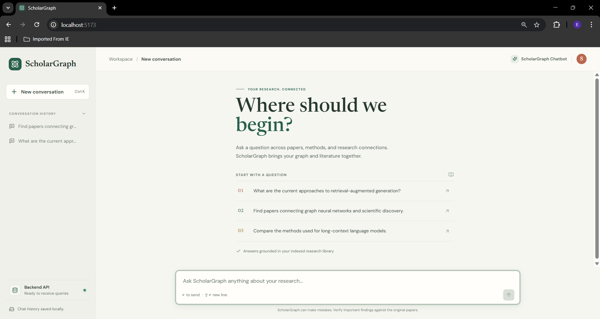
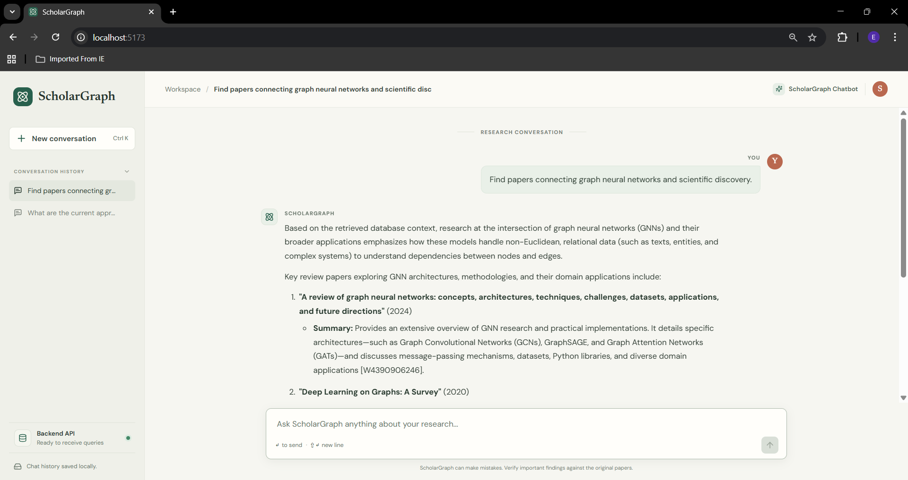
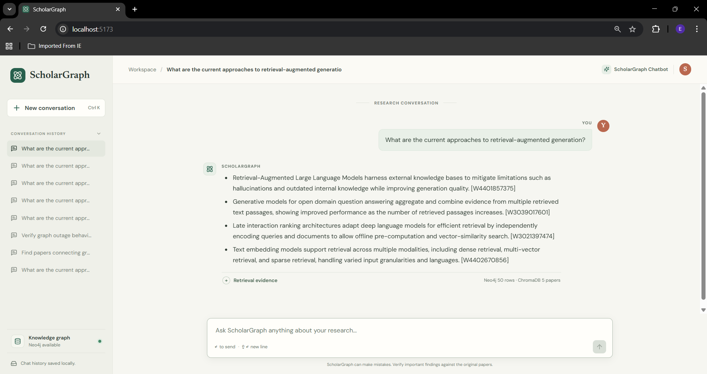

# ScholarGraph

> A research assistant that combines knowledge-graph traversal and semantic paper search to answer questions about academic literature.

ScholarGraph connects structured paper relationships (authors, categories, and methods) with unstructured abstract text. The Python backend uses **Neo4j** for graph queries, **ChromaDB** for semantic retrieval, and **Google Gemini** for query translation and answer synthesis. A separate **React** frontend communicates with the backend over HTTP.

---

## Architecture & System Overview

```
+----------------------------------------------------------------------------------+
|                               PHASE 1: INGESTION                                  |
|                                                                                   |
|  [ OpenAlex API ] ---> Fetch Metadata & Abstracts                                 |
|                           |                                                       |
|                           +---> [ Gemini API ] --------> Extract Graph Triples    |
|                           |                                (Nodes & Edges)        |
|                           |                                       |               |
|                           v                                       v               |
|            [ SentenceTransformers (T4 GPU) ]              [ Neo4j Local ]         |
|                           |                             (Graph DB Ingestion)      |
|                           v                                                       |
|                  [ ChromaDB Local ]                                               |
|                (Vector DB Ingestion)                                              |
+-----------------------------------------------------------------------------------+

+-----------------------------------------------------------------------------------+
|                                PHASE 2: AGENTIC QUERY                             |
|                                                                                   |
|                                [ User Input Query ]                               |
|                                         |                                         |
|                                         v                                         |
|                              [ ScholarGraph Agent ]                               |
|                    (Gemini query translation and synthesis)                       |
|                                         |                                         |
|                  +----------------------+----------------------+                  |
|                  |                                             |                  |
|                  v                                             v                  |
|       [ Cypher Query Tool ]                         [ Vector Retrieval Tool ]     |
|                 |                                              |                  |
|                 v                                              v                  |
|      (Traverses Neo4j Graph)                     (Searches ChromaDB Abstracts)    |
|                 |                                              |                  |
|                 +----------------------+-----------------------+                  |
|                                         |                                         |
|                                         v                                         |
|                             [ Gemini Synthesis Agent ]                            |
|                           (Context-grounded answer)                               |
+-----------------------------------------------------------------------------------+

```

---

## Tech Stack

| Layer | Technology | Execution Environment |
| --- | --- | --- |
| **LLM Reasoning** | Google Gemini API (`google-genai`) | Cloud API |
| **Data Collection** | OpenAlex-based collection script and JSON paper artifacts | Colab-oriented pipeline / local files |
| **Embeddings** | `BAAI/bge-small-en-v1.5` | Google Colab (T4 GPU) / Local |
| **Vector Database** | ChromaDB (Persistent Disk Mode) | Local Machine |
| **Graph Database** | Neo4j Community (Docker Container) | Local Machine (`localhost:7687`) |
| **Backend API** | FastAPI + Uvicorn | Local Python process |
| **Frontend** | React, TypeScript, Vite | Browser / Node.js development server |

---

## Core Concepts

### GraphRAG

Retrieval-augmented generation (RAG) gives a language model relevant source material at answer time instead of asking it to rely only on its training data. GraphRAG adds a knowledge graph to that process. ScholarGraph runs a graph lookup and a semantic text lookup, then gives both result sets to Gemini for synthesis.

### Knowledge graph

A knowledge graph represents entities as **nodes** and their connections as **relationships**. ScholarGraph models `Paper`, `Author`, `Category`, and `Concept` nodes. Relationships include `AUTHORED`, `IN_CATEGORY`, and `USES_METHOD`. Neo4j stores this structure and Cypher expresses traversals such as “which authors used this method?”

### Embeddings and vector search

An embedding is a numeric representation of text that places semantically similar passages near one another in vector space. The project uses SentenceTransformers with `BAAI/bge-small-en-v1.5` to embed abstracts. ChromaDB stores those vectors with the abstract and metadata, then finds text relevant to a natural-language question by similarity rather than exact keyword matching.

### Hybrid retrieval and answer synthesis

The backend asks Gemini to translate a question into Cypher, executes a read-only Neo4j graph traversal, retries with parameterized keyword matching if that query is rejected or returns no rows, searches ChromaDB for five relevant abstracts, and only then asks Gemini to synthesize findings. Each finding must cite a paper ID present in the retrieved records; responses with no citable evidence or invented citation IDs are rejected. The saved answer includes a retrieval trace with every Cypher attempt, returned graph rows, and vector-paper excerpts. The lookups are sequential and independent, not graph-conditioned vector search.

This makes retrieval inspectable and citation IDs verifiable, but it cannot mathematically prove that a cited passage entails every generated claim. Review the displayed paper excerpts and original papers for important conclusions.

### API boundary and frontend

The React application does not connect directly to Gemini, Neo4j, or ChromaDB. It uses FastAPI to create, list, load, and delete conversations and sends messages to `POST /api/chat` with a conversation ID. The backend stores messages and their retrieval traces in local SQLite and supplies recent turns to the agent. Each assistant message has an expandable evidence panel showing graph results and retrieved paper excerpts. The Vite development server proxies `/api` to FastAPI; API credentials remain in the backend environment.

## Data Pipeline

The pipeline starts with paper metadata and abstracts, enriches each paper with author/category/method relationships, and produces dense embeddings of abstract text. Graph triples are imported into Neo4j; precomputed embeddings are imported into the persistent ChromaDB collection named `arxiv_papers`. The existing `data/README.md` documents the artifact fields and formats. The paper-collection script is Colab-oriented, while local extraction and database import utilities live in `backend/src/scholargraph/`.

The repository may not contain every generated artifact: embedding Parquet files and the persistent Chroma index are local/generated data and should be provisioned for the environment. Neo4j must also be running and hydrated before research queries can return useful results.

## Run the Application

The backend and frontend have separate setup and run guides:

- [Backend setup and API guide](backend/README.md)
- [Frontend setup and development guide](frontend/README.md)

For a local chat session, start the FastAPI server from `backend/`, then start Vite from `frontend/`. The frontend is served at <http://localhost:5173> and the API defaults to <http://127.0.0.1:8000>.

---

## Application Screenshots

### Start a conversation

The landing page offers example queries, a query box, and access to previous conversations.



### Example: Graph neural networks



### Example: Retrieval-augmented generation



---

## Example Interaction

**User Query:**

> *"Which researchers are collaborating on Graph Neural Networks, and what key techniques are they using in their recent abstracts?"*

**Agent Execution Strategy:**

1. **Query translation:** Gemini creates a Cypher query from the user's question and the known graph schema.
2. **Cypher Tool Execution:** Queries Neo4j for co-authorship relationships and paper IDs within the "Graph Neural Networks" category.

```cypher
MATCH (a1:Author)-[:AUTHORED]->(p:Paper)<-[:AUTHORED]-(a2:Author)
MATCH (p)-[:USES_METHOD]->(c:Concept {name: "Graph Neural Networks"})
RETURN a1.name, a2.name, p.id, p.title

```

1. **Vector retrieval:** ChromaDB finds abstracts semantically related to the original question.
2. **Answer synthesis:** Gemini combines graph records and retrieved abstracts into a concise response. Answers should be checked against the cited source papers.

---
